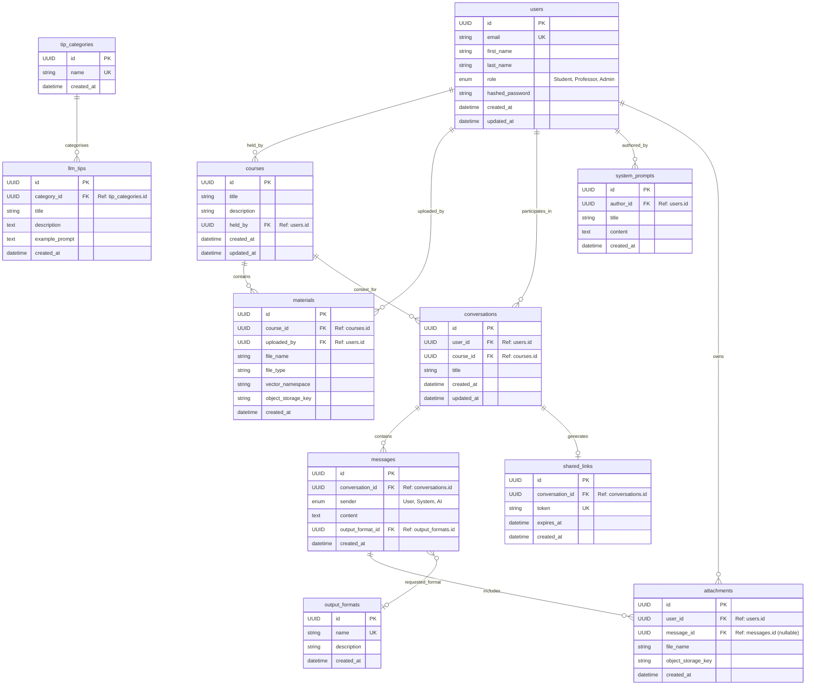
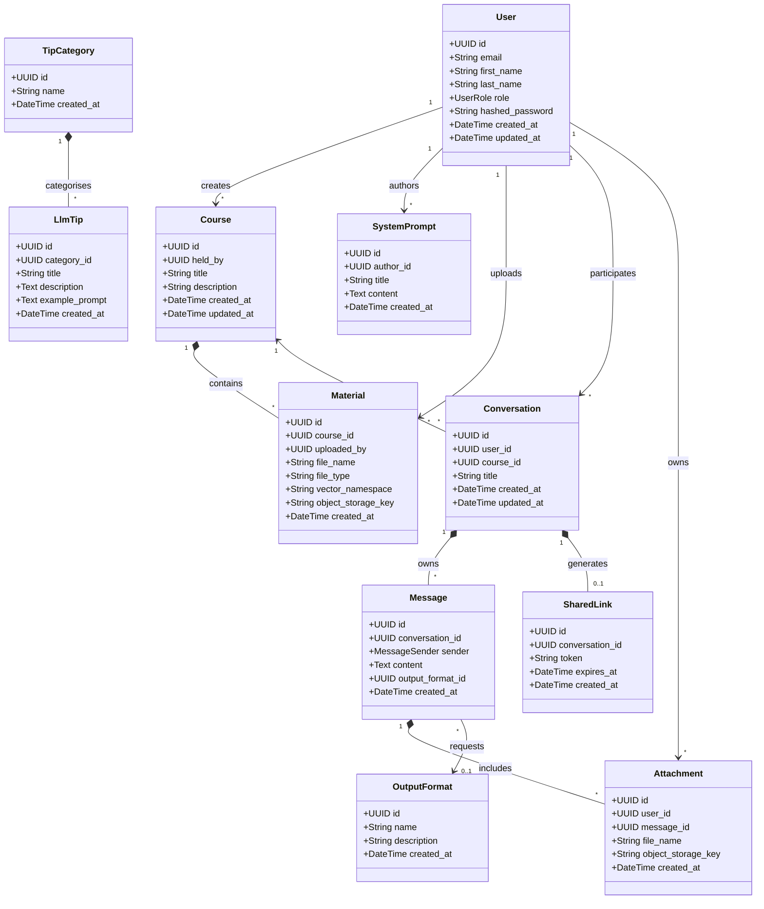
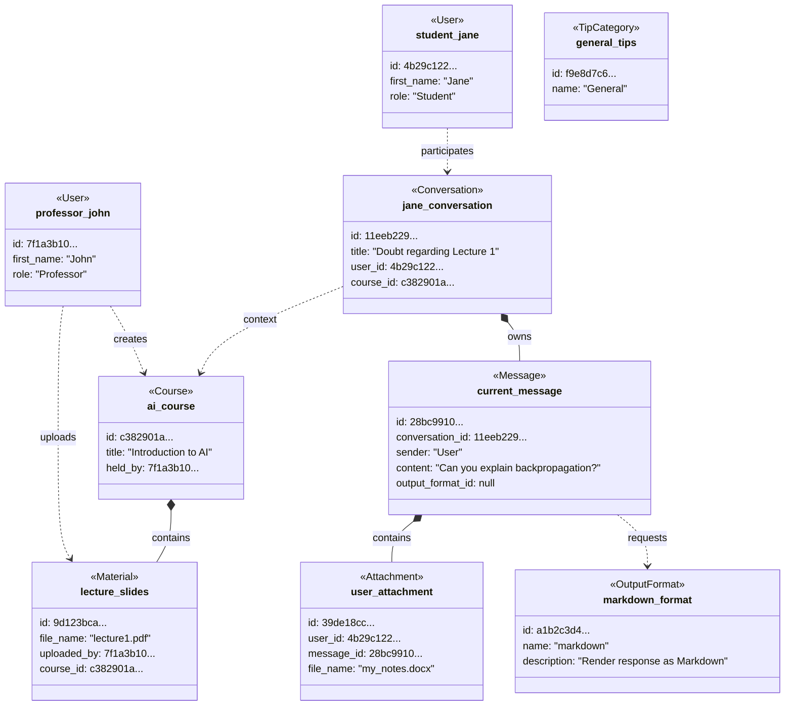

# Database Schema

This document contains the Entity-Relationship mapping for the local PostgreSQL database, generated from the underlying SQLModel implementation.

## Class Diagram

This diagram visualizes the Object-Oriented mapping used by SQLModel (and FastAPI schemas) in the codebase.

## Object Diagram (Example State)

This diagram shows a sample instantiation of the models at a specific point in time to visualize the relationships in action.

